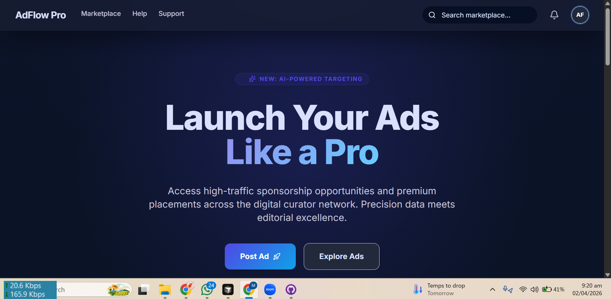
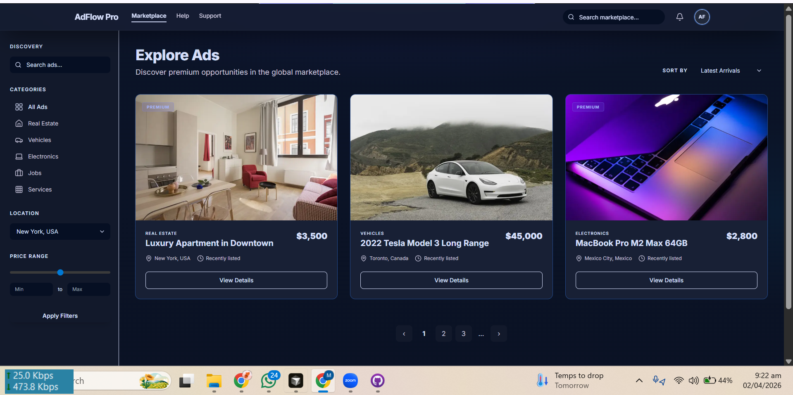
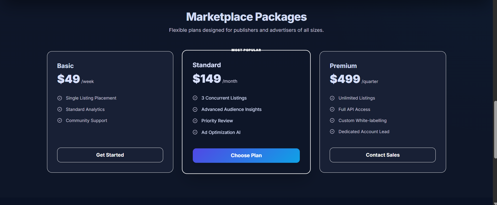

# AdFlow Pro

**Sponsored listing marketplace** — Next.js 16, MongoDB + Supabase, role-based dashboards, JWT authentication, and a production-ready UI.

<p align="center">
  <a href="https://ad-flow-pro-ai.vercel.app"></a>
  &nbsp;
  <a href="https://github.com/Arslan-web-Dev/AdFlow-Pro-AI"></a>
</p>

<p align="center">
  <a href="https://nextjs.org/"></a>
  <a href="https://www.typescriptlang.org/"></a>
  <a href="https://www.mongodb.com/"></a>
  <a href="https://supabase.com/"></a>
  <a href="https://opensource.org/licenses/MIT"></a>
</p>

---

### Demo Credentials

Use these demo accounts to test different roles:

| Role | Email | Password |
|------|-------|----------|
| **Super Admin** | superadmin@adflow.com | SuperAdmin123 |
| **Admin** | admin@adflow.com | Admin123 |
| **Moderator** | moderator@adflow.com | Moderator123 |
| **Client** | client@adflow.com | Client123 |

**Note:** These demo accounts are created by running the seed script. To create them, run:
```bash
npx tsx scripts/seed-ads.ts
```

---

### Quick links

| Resource | URL |
|----------|-----|
| **Live application** | [https://ad-flow-pro-ai.vercel.app](https://ad-flow-pro-ai.vercel.app) |
| **Source code** | [https://github.com/Arslan-web-Dev/AdFlow-Pro-AI](https://github.com/Arslan-web-Dev/AdFlow-Pro-AI) |
| **Deploy guide** | [docs/DEPLOY.md](docs/DEPLOY.md) |
| **Screenshots** | [Screenshots/](Screenshots/) (portfolio images in-repo) |

---

## Table of contents

| | |
|--|--|
| 1 | [Key features](#key-features) |
| 2 | [Core product overview](#core-product-overview) |
| 3 | [Profile, auth & accent themes](#profile-auth--accent-themes) |
| 4 | [Screenshots](#screenshots) |
| 5 | [Project summary](#project-summary) |
| 6 | [UI and design system](#ui-and-design-system) |
| 7 | [Technology stack](#technology-stack) |
| 8 | [Architecture](#architecture) |
| 9 | [Repository layout](#repository-layout) |
| 10 | [Routes](#routes) |
| 11 | [Authentication and RBAC](#authentication-and-rbac) |
| 12 | [Core systems](#core-systems) |
| 13 | [Database schema](#database-schema) |
| 14 | [Environment variables](#environment-variables) |
| 15 | [Getting started](#getting-started) |
| 16 | [Deploy (go live)](#deploy-go-live) |
| 17 | [Scripts](#scripts) |
| 18 | [Important files](#important-files) |
| 19 | [Roadmap](#roadmap) |
| 20 | [Contributing](#contributing) |
| 21 | [License](#license) |
| 22 | [Author](#author) |

---

## Key features

- **Dark marketplace UI** — Material-style tokens, glass header, gradients, **Inter** typography, responsive layouts.
- **Marketing site** — Landing with hero, featured listings, pricing, and clear CTAs to explore or sign up.
- **Browse & discovery** — **Explore** with filters (category, city, price), ranked listing cards, and smooth navigation to detail pages.
- **Listing pages** — **Ad detail** with media gallery, seller card, location, and package context.
- **Seller workspace** — **Dashboard** KPIs, ads table, activity, **create listing** wizard (category, city, package, payment steps), and profile/settings shells.
- **Trust & operations** — **Moderator** queue and **Admin** analytics, payments review, and user role management (UI flows; connect to Supabase for production data).
- **Auth & security** — **Supabase Auth** with `@supabase/ssr`; **`middleware.ts`** enforces sessions and **RBAC** (`client` → `moderator` → `admin` / `super_admin`).
- **Ranking** — `lib/ranking-system.ts` scores listings using featured flag, package weight, seller verification, freshness, and optional admin boost.
- **Optional AI** — `/api/ai/*` routes for helpers when `OPENAI_API_KEY` is set.
- **Integrated profile** — `/dashboard/profile` shows the signed-in user’s **email**, **@username**, and display name from Supabase Auth (real-time via `onAuthStateChange`); optional sync to `public.users` when your RLS policies allow updates.
- **Global accent themes** — **10 brand color presets** on the landing page (and again under Profile → Appearance). Choice is stored in `localStorage` and drives CSS variables across the whole app (`data-accent` on `<html>`).

---

## Core product overview

| Area | What users get |
|------|----------------|
| **Visitors** | Browse featured and ranked ads, open any listing, view pricing plans, and sign in or register. |
| **Clients (sellers)** | Post and manage sponsored listings, pick packages, and complete payment flows in the dashboard. |
| **Moderators** | Review pending content from a dedicated queue. |
| **Admins** | View analytics, verify payments, and adjust user roles. |

**Production note:** Sign-in on the [live demo](https://ad-flow-pro-ai.vercel.app) requires valid **Supabase** environment variables on Vercel (`NEXT_PUBLIC_SUPABASE_URL`, `NEXT_PUBLIC_SUPABASE_ANON_KEY`, `SUPABASE_SERVICE_ROLE_KEY`) and matching Auth/DB setup. 

**Troubleshooting:** Use the **debug endpoint** to verify your configuration:
- Development: `http://localhost:3000/api/debug/connection`
- Production: `https://your-app.vercel.app/api/debug/connection`

See [`VERCEL_FIX_CHECKLIST.md`](VERCEL_FIX_CHECKLIST.md) for detailed troubleshooting steps.

---

## Profile, auth & accent themes

| Topic | Implementation |
|-------|------------------|
| **Session & profile row** | `components/providers/auth-provider.tsx` loads the Supabase session and, when possible, `public.users` (`role`, `name`, `avatar_url`) for the current user. |
| **Header / sidebar** | `components/layouts/dashboard-top-bar.tsx` shows **display name**, **@username**, and **role** for whoever is logged in (no more placeholder “Alex Sterling”). |
| **Profile & control panel** | `app/dashboard/profile/page.tsx` — account summary, read-only control info (user id, last sign-in), **Appearance** (accent buttons), and editable **username** / name / phone / city persisted with `auth.updateUser` + optional `users` update. |
| **Registration** | `app/auth/register/page.tsx` collects **username** (validated `a-z`, `0-9`, `_`, length 3–24) stored in `user_metadata`. |
| **Accent packs** | `lib/color-themes.ts` defines presets; `AccentThemeProvider` + `app/globals.css` `[data-accent="…"]` rules retint `--primary`, `--accent`, charts, and gradients site-wide. |

---

## Screenshots

Images below live in [`Screenshots/`](Screenshots/) (same folder name as on [GitHub](https://github.com/Arslan-web-Dev/AdFlow-Pro-AI/tree/main/Screenshots)). Filenames with spaces use URL-encoded paths so they render correctly on GitHub.

| File | What it shows |
|------|----------------|
| `lendingpage1.png` | Landing — hero & primary CTA |
| `lendingpage2.png` | Landing — featured / content section |
| `lendingpage3.png` | Landing — lower section (e.g. pricing teaser or footer) |
| `add page.png` | Seller flow — create or edit listing |
| `add details.png` | Listing detail — media, seller, metadata |
| `plans.png` | Pricing & packages |
| `loginpage.png` | Sign-in screen (`/auth/login`) |
| `Email_.png` | Email-related UI (signup / capture strip) |

**Monorepo deploy:** If this app is not at the Git repo root on Vercel, set **Root Directory** to the folder that contains `package.json` — illustrated in [`docs/screenshots/vercel-root-directory.png`](docs/screenshots/vercel-root-directory.png).

### Landing






### Create listing


### Listing detail


### Pricing



### Sign in


### Email


### Vercel: Root Directory (folder pick)


---

## Project summary

Unauthenticated users can use the marketing site, browse listings, and open ad details. After sign-in, users access `/dashboard`; moderators and admins additionally use `/moderator` and `/admin`. Session cookies and role checks are handled by Supabase and `middleware.ts`.

---

## UI and design system

Dark, **Material-inspired** palette: deep navy surfaces, indigo primary (`#4f46e5`), cyan accent, high-contrast text.

| Topic | Where |
|-------|--------|
| CSS variables and utilities | `app/globals.css` (`--background`, `--card`, `--primary`, `.af-glass-header`, `.af-gradient`, …) |
| Tailwind semantic colors | `tailwind.config.ts` — `surface`, `surface-container`, `on-surface`, … |
| Font | [Inter](https://fonts.google.com/specimen/Inter) in `app/layout.tsx` |
| Public chrome | `components/layouts/main-nav.tsx`, `site-footer.tsx` |
| App shell | `dashboard-shell.tsx`, `dashboard-sidebar.tsx` |

---

## Technology stack

### Frontend

| Layer | Technology |
|-------|------------|
| Framework | Next.js 16 (App Router), React 19 |
| Language | TypeScript 5 |
| Styling | Tailwind CSS v4, project tokens |
| Components | shadcn/ui-style + Base UI |
| Icons | Lucide React |
| Animations | Framer Motion |
| State Management | Zustand |
| Validation | Zod |

### Backend and data

| Layer | Technology |
|-------|------------|
| Primary Database | MongoDB (Mongoose ODM) |
| Secondary Database | Supabase (PostgreSQL) - for sync/backup |
| Authentication | JWT (jsonwebtoken) |
| Authorization | Custom RBAC middleware |
| Data Sync | MongoDB to Supabase sync service |
| Cron Jobs | node-cron for scheduled tasks |
| API Routes | Next.js 16 API routes |
| Optional AI | OpenAI via `/api/ai/*` |
| Password Hashing | bcryptjs |

---

## Architecture

```
Browser
   │
   ▼
middleware.ts     JWT auth, RBAC by path
   │
   ▼
Next.js App Router (API Routes + Pages)
   ├── Public:  /, /explore, /ad/[slug], /auth/*
   ├── /dashboard/*     (client+)
   ├── /moderator/*     (moderator+)
   ├── /admin/*         (admin, super_admin)
   └── /api/*           (REST API)
   │
   ├─────────────────────────────────────┐
   ▼                                     ▼
MongoDB (Primary)                   Supabase (Sync/Backup)
- Users                               - Users (synced)
- Ads                                 - Ads (synced)
- Categories                          - Categories (synced)
- Cities                              - Cities (synced)
- Packages                            - Packages (synced)
- Payments                            - Payments (synced)
- Logs                                - Logs (synced)
- Analytics                           - Analytics (synced)
- System Health Logs
```

---

## Repository layout

```
AdFlow-Pro-AI/
├── Screenshots/            # README portfolio images (landing, login, …)
├── docs/
│   ├── screenshots/        # e.g. vercel-root-directory.png (deploy)
│   └── DEPLOY.md
├── scripts/                # Seed and sync scripts
│   ├── seed-ads.ts        # MongoDB seeding script
│   ├── sync-ads-to-supabase.ts  # Sync script
│   └── sync-to-supabase.ts  # Full sync script
├── supabase-setup.sql      # Supabase database schema
├── app/                      # Routes, layouts, API routes
├── components/               # layouts/, providers/, theme/, ui/
├── lib/                      # Utilities and helpers
│   ├── db/                 # MongoDB connection
│   ├── models/             # Mongoose models (User, Ad, Category, etc.)
│   ├── auth/               # JWT authentication
│   ├── supabase/           # Supabase client and sync
│   ├── ai/                 # AI integration
│   └── utils/              # Utility functions
├── src/                      # Backend architecture
│   ├── architecture/
│   │   ├── config/        # Configuration files
│   │   ├── cron/          # Scheduled jobs
│   │   ├── middleware/    # Custom middleware
│   │   ├── repositories/  # Data access layer
│   │   └── services/      # Business logic layer
│   └── models/            # TypeScript interfaces
├── middleware.ts
├── next.config.ts
├── tailwind.config.ts
└── package.json
```

---

## Routes

### Public

| Path | Description |
|------|-------------|
| `/` | Marketing and pricing |
| `/explore` | Browse listings |
| `/ad/[slug]` | Listing detail |
| `/auth/*` | Login, register, OAuth callback |

### Authenticated (representative)

| Prefix | Minimum role |
|--------|----------------|
| `/dashboard` | `client` |
| `/moderator` | `moderator` |
| `/admin` | `admin` or `super_admin` |

### API (representative)

| Prefix | Purpose | Notes |
|--------|---------|-------|
| `/api/ai/*` | Optional AI helpers | Requires `OPENAI_API_KEY` |
| `/api/cron/*` | Scheduled jobs (e.g. expiry) | Server-side automation |
| `/api/public/ads` | **NEW** — Fetch published ads | Fallback from MongoDB to Supabase |
| `/api/debug/connection` | **NEW** — Debug database status | Check env vars and connectivity |

---

## Authentication and RBAC

1. **Supabase Auth** creates the session; **`@supabase/ssr`** reads/writes cookies on server and client.
2. **`middleware.ts`** refreshes the session, loads the user, reads `role` from `public.users`, and redirects if the role is insufficient for the path.
3. **`DashboardSidebar`** adjusts visible links based on whether you are under `/admin`, `/moderator`, or `/dashboard`.

Illustrative logic (see `middleware.ts` for the real code):

```typescript
if (!user && isProtectedPath(pathname)) redirect('/auth/login')
if (pathname.startsWith('/admin') && !isAdminRole(role)) redirect('/dashboard')
```

Role capability (high → low): `super_admin`, `admin`, `moderator`, `client`.

---

## Core systems

### Listing rank

**File:** `lib/ranking-system.ts` — combines featured status, package weight, seller verification, admin boost, and time-based freshness. Higher scores sort earlier when the browse API uses this field.

### Database Connectivity & Fallback

**File:** `app/api/public/ads/route.ts` — Smart fallback system:
1. **Primary:** MongoDB (local development)
2. **Fallback:** Supabase PostgreSQL (Vercel production)
3. **Error Handling:** Detailed error messages with HTTP status codes

**File:** `app/api/debug/connection.ts` — Diagnostic endpoint to verify:
- MongoDB URI configuration
- Supabase credentials (URL, Anon Key, Service Role Key)
- Database connectivity status
- Recommendations for fixing issues

Test with: `curl https://your-app.vercel.app/api/debug/connection`

### Supabase clients

| File | Context |
|------|---------|
| `lib/supabase/client.ts` | Client Components |
| `lib/supabase/server.ts` | Server Components, Route Handlers, `middleware.ts` |

### UI kit

Shared primitives live in `components/ui/` and follow the same design tokens as the rest of the app.

---

---

## Database schema

### MongoDB (Primary Database)

MongoDB models are defined in `lib/models/`:

- **User**: `_id`, email, password, name, role, avatar, isActive, isVerified
- **Ad**: `_id`, userId, packageId, categoryId, cityId, title, slug, description, status, tags, publishAt, expireAt, isFeatured, rankScore, adminBoost, verifiedSellerPoints, rejectionReason, moderatorId, moderationNote
- **Category**: `_id`, name, slug, isActive
- **City**: `_id`, name, slug, isActive
- **Package**: `_id`, name, durationDays, weight, isFeatured, homepageVisibility, autoRefreshDays, price, features, isActive
- **Payment**: `_id`, userId, adId, amount, status, paymentMethod, transactionId
- **Log**: `_id`, level, action, userId, adId, details, ipAddress, userAgent
- **Analytics**: `_id`, date, totalUsers, totalAds, activeAds, pendingAds, totalRevenue, dailyRevenue, newUsers, newAds, adsByStatus, adsByCategory, usersByRole, aiGeneratedAds
- **SystemHealthLog**: `_id`, source, responseMs, status, errorMessage, checkedAt

### Supabase (Sync/Backup Database)

Run the `supabase-setup.sql` script in the Supabase SQL editor to create the sync tables:

```bash
# Run the setup script
# Copy contents of supabase-setup.sql and run in Supabase SQL Editor
```

The Supabase schema mirrors MongoDB with tables for:
- users, categories, cities, packages, ads, payments, logs, analytics, notifications

Data is synced from MongoDB to Supabase using the sync scripts.

---

## Environment variables

Root file: **`.env.local`** (do not commit).

```bash
# MongoDB
MONGODB_URI=mongodb://localhost:27017/adflow-pro

# Supabase
NEXT_PUBLIC_SUPABASE_URL=https://YOUR_PROJECT_REF.supabase.co
NEXT_PUBLIC_SUPABASE_ANON_KEY=YOUR_ANON_KEY
SUPABASE_SERVICE_ROLE_KEY=YOUR_SERVICE_ROLE_KEY

# JWT Authentication
JWT_SECRET=your-secret-key-here

# Optional
OPENAI_API_KEY=your-openai-api-key
NEXT_PUBLIC_APP_URL=http://localhost:3000
NODE_ENV=development
```

Only `NEXT_PUBLIC_*` keys are available in the browser.

---

## Getting started

**Prerequisites:** Node.js ≥ 18.17, npm ≥ 9 (or pnpm/yarn), MongoDB, a Supabase project.

```bash
git clone https://github.com/Arslan-web-Dev/AdFlow-Pro-AI.git
cd AdFlow-Pro-AI
npm install
```

### 1. Setup MongoDB

Ensure MongoDB is running on your system:
- **Windows:** Run MongoDB as a service or start `mongod` manually
- **Mac/Linux:** Install MongoDB and start the service

### 2. Setup Supabase

1. Create a Supabase project at https://supabase.com
2. Run the `supabase-setup.sql` script in the Supabase SQL Editor to create the database tables

### 3. Configure Environment Variables

Create `.env.local` with the required variables (see Environment Variables section above).

### 4. Seed Database

Run the seed script to create demo users and sample ads:

```bash
npx tsx scripts/seed-ads.ts
```

This will create:
- 4 demo users (super_admin, admin, moderator, client)
- 10 categories
- 6 cities
- 1 package
- 30 sample ads

### 5. Sync to Supabase (Optional)

Sync MongoDB data to Supabase:

```bash
npx tsx scripts/sync-ads-to-supabase.ts
```

### 6. Start Development Server

```bash
npm run dev
```

Application: [http://localhost:3000](http://localhost:3000).

### 7. Test the Setup

**Check database connectivity:**
```bash
curl http://localhost:3000/api/debug/connection
```

**Fetch ads (should return published ads):**
```bash
curl http://localhost:3000/api/public/ads?status=published&limit=10
```

**Visit marketplace:**
```
http://localhost:3000/marketplace
```

---

## Deploy (go live)

Use the [Vercel dashboard](https://vercel.com/muhammad-arslans-projects-6abbf6f8) (GitHub login) and import **[Arslan-web-Dev/AdFlow-Pro-AI](https://github.com/Arslan-web-Dev/AdFlow-Pro-AI)**.

### Quick Deployment Guide

1. Push the repo to GitHub.
2. **Add New → Project** → import the repository.
3. **Root Directory:** leave default **`.`** when this repo is only the Next.js app. If the app lives inside a **parent monorepo folder**, set Root Directory to that subfolder (see screenshot in [Screenshots](#screenshots)).
4. **Environment variables** (CRITICAL FOR VERCEL):
   - `NEXT_PUBLIC_SUPABASE_URL` — Your Supabase project URL
   - `NEXT_PUBLIC_SUPABASE_ANON_KEY` — Your Supabase Anon Key  
   - `SUPABASE_SERVICE_ROLE_KEY` — Your Supabase Service Role Key
   - `JWT_SECRET` — Your JWT secret for authentication
   - `NEXT_PUBLIC_APP_URL` — Your Vercel app URL
5. **Deploy** → example URL: [ad-flow-pro-ai.vercel.app](https://ad-flow-pro-ai.vercel.app).

### Important: Fixing "Ads Not Showing" on Vercel

**New in this version:**
- ✅ Enhanced error handling in `/api/public/ads` endpoint
- ✅ Debug endpoint at `/api/debug/connection` to verify configuration
- ✅ Improved error messages in marketplace UI
- ✅ Comprehensive deployment guides

**Troubleshooting:**
1. Visit `https://your-app.vercel.app/api/debug/connection` to check configuration status
2. Verify all Supabase environment variables are set correctly on Vercel
3. Ensure Supabase tables (`ads`, `users`) exist in your database
4. Check Vercel logs for detailed error messages

See [`VERCEL_DEPLOYMENT_GUIDE.md`](VERCEL_DEPLOYMENT_GUIDE.md) and [`VERCEL_FIX_CHECKLIST.md`](VERCEL_FIX_CHECKLIST.md) for detailed steps.

Full steps: [`docs/DEPLOY.md`](docs/DEPLOY.md).

---

## Scripts

| Command | Description |
|---------|-------------|
| `npm run dev` | Development server |
| `npm run build` | Production build (runs lint) |
| `npm start` | Serve production build |
| `npm run lint` | ESLint |

---

## Important files

| Path | Purpose |
|------|---------|
| `middleware.ts` | Auth + RBAC |
| `app/layout.tsx` | Root layout, `AccentThemeProvider`, `AuthProvider` |
| `app/globals.css` | Design tokens + `[data-accent]` theme packs |
| `lib/color-themes.ts` | Accent preset definitions |
| `lib/auth-display.ts` | Display name / username helpers |
| `lib/ranking-system.ts` | Listing score |
| `lib/supabase/client.ts`, `server.ts` | Supabase entry points |
| `components/providers/auth-provider.tsx` | Session + `public.users` profile |
| `app/dashboard/profile/page.tsx` | Profile & control panel |
| `components/layouts/dashboard-top-bar.tsx` | Live user header |
| `components/layouts/dashboard-sidebar.tsx` | Nav + mobile drawer |
| `app/api/public/ads/route.ts` | Public ads API (with enhanced error handling) |
| `app/api/debug/connection.ts` | **NEW** — Debug endpoint to verify DB configuration |
| `VERCEL_DEPLOYMENT_GUIDE.md` | **NEW** — Complete Vercel deployment guide |
| `VERCEL_FIX_CHECKLIST.md` | **NEW** — Quick checklist for fixing ads on Vercel |

---

## Roadmap

- [ ] Wire UI to live Supabase data
- [ ] Working explore filters (category, city, price)
- [ ] Media upload for new listings
- [ ] Persist moderator actions
- [ ] Admin payment review flow
- [ ] Row Level Security on all tables
- [x] Deploy to Vercel (set Supabase env vars for working auth)
- [x] Fix ads not showing on Vercel (enhanced error handling + debug endpoint)
- [x] Improved error messages in marketplace UI

---

## Recent Updates (v2.0)

### Bug Fixes

✅ **Fixed ads not showing on Vercel**
- Enhanced error handling in `/api/public/ads` endpoint
- Added proper fallback from MongoDB to Supabase
- Improved error messages with HTTP status codes (503/500)
- Added detailed logging for debugging

### New Features

✅ **Debug Endpoint**
- Visit `/api/debug/connection` to verify database configuration
- Shows status of all environment variables
- Indicates MongoDB and Supabase connectivity
- Provides recommendations for fixing issues

✅ **Improved Marketplace UI**
- Error state with retry functionality
- Better loading states
- Detailed error messages for "ads not found" scenarios
- Console logging for debugging

✅ **New Documentation**
- [`VERCEL_DEPLOYMENT_GUIDE.md`](VERCEL_DEPLOYMENT_GUIDE.md) — Complete deployment guide
- [`VERCEL_FIX_CHECKLIST.md`](VERCEL_FIX_CHECKLIST.md) — Quick reference checklist

### Code Changes

| File | Changes |
|------|---------|
| `app/api/public/ads/route.ts` | Enhanced error handling, better logging, proper HTTP status codes |
| `app/api/debug/connection.ts` | New debug endpoint to verify configuration |
| `app/marketplace/page.tsx` | Improved error/loading UI, better state management |
| `lib/db/mongodb.ts` | Improved connection error handling |

---

## Contributing

Issues and pull requests are welcome on your fork. For course submissions, follow your instructor’s collaboration rules.

---

## License

MIT. Add a root `LICENSE` file if your institution or publication requires it.

---

## Author

**Muhammad Arslan** — FA23-BCS-030 · Web technologies — AdFlow Pro (coursework).
